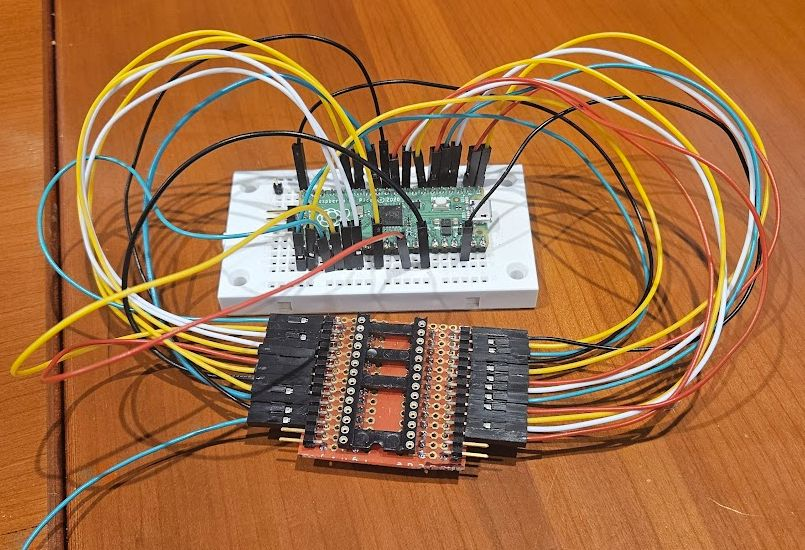

# ROM Reader Using a Pi Pico

While debugging a problem with my old Eight Ball pinball machine, I had a need to dump the contents of its ROMs.
Not owning a reader, I made one out of a Pi Pico and a socket on a breadboard.

## Wiring

The software assumes that the pico is wired to the ROM as follows:

|Signal|Pico GPIO|Pico Pin|ROM Pin|Notes|
|-|-|-|-|-|
|A0|GP0|1|8||
|A1|GP1|2|7||
|A2|GP2|4|6||
|A3|GP3|5|5||
|A4|GP4|6|4||
|A5|GP5|7|3||
|A6|GP6|9|2||
|A7|GP7|10|1||
|A8|GP8|11|23||
|A9|GP9|12|22||
|A10|GP10|14|19||
|A11|GP11|15|-|Not used|
|A12|GP12|16|-|Not used|
|A13|GP13|17|-|Not used|
|A14|GP14|19|-|Not used|
|D0|GP15|20|9||
|D1|GP16|21|10||
|D2|GP17|22|11||
|D3|GP18|24|13||
|D4|GP19|25|14||
|D5|GP20|26|15||
|D6|GP21|27|16|||
|D7|GP22|29|17||
|-|GP23|-|-|Not Available on a Pico|
|-|GP24|-|-|Not Available on a Pico|
|-|GP25|-|-|Not Available on a Pico|
|-|GP26|-|-|Unused, available|
|OE|GP27|32|18|ROM CE on pin 18 (Active HIGH on a 9316!)|
|OE|GP28|34|20|ROM OE (Active LOW)|

To read 9316 ROMs, make sure to power the ROM pin 24 (VCC) with exactly 3.5 volts.

You will end up with a nice wad of wires, as below:

I wired things to a 28 pin socket instead of the 24 pin socket because I already had one mounted on a breadboard.
The 24-pin ROM is meant to sit in the back of the socket so that the 4 pins closest to the camera are unused.

## Software

The software should just build using VS Code.
It's basically a 'hello world' build environment for C++ programming using the Pi Pico that has been extended to be a quick & dirty ROM reader.

Run the program, and if everything is going OK, the LED will blink as it repeatedly reads the ROM contents into a buffer.
Each time after the first time, the program verifies that the new read matches the data read the first time around.
If the program stops at a breakpoint, there is a problem.
The comments around the area of the breakpoints will tell you what is wrong.
If there are no problems, you can stop execution of the program anytime, for example, by setting a debugger breakpoint where the program sleeps to make the LED blink.

Once stopped, find out the start address of the 'contents' buffer.
One way is to use the debugger's memory window, and ask it to dump memory starting at "&contents[0]". That will tell you the start address.
In my case, it was at 0x20001000.

In the debug console window tab, type the following GDB command:

    dump binary memory <full-path-to-some-location>/rom.bin 0x20001000 0x20001800

GDB will write a binary file called 'rom.bin' in the location you specified.
It will contain the 2K bytes in the ROM that were read and verified for consistency.

Once on your machine, you can use 'od' to dump the rom.bin data in human-readable fashion, or the linux 'hexdiff' command to compare it to a different binary file.

This whole process could be improved, but like I said, it was developed as a "quick and dirty" because I was more interested in verifying my ROMs and getting my machine working than creating a beautiful, generic ROM reader.
